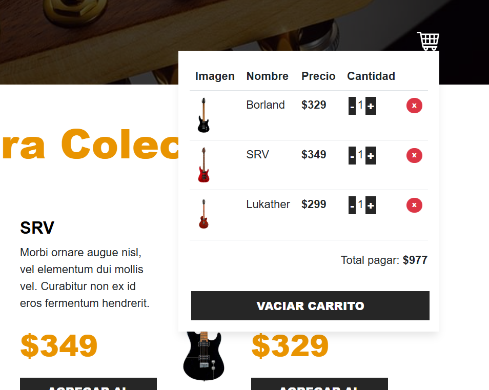

# 🎸 GuitarLA

E-commerce de guitarras desarrollado con React y TypeScript. Este proyecto simula una tienda online con carrito de compras y experiencia de usuario moderna.

## 🧪 Tecnologías utilizadas

- ⚛️ React
- 🟦 TypeScript
- ⚡ Vite
- 🎨 Tailwind CSS
- 🌀 useReducer
- 🧰 ESLint + TypeScript Plugin

## 🚀 Demo en vivo

👉 [https://guitarla-usereducer-mc.netlify.app/](https://guitarla-usereducer-mc.netlify.app/)

## 🖼️ Capturas

Vista del home:

Vista del carrito:

